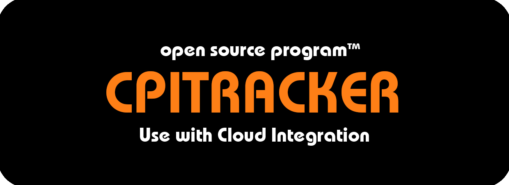

Welcome to the CPITracker GitHub repository!

## What is CPITracker?

CPITracker keeps you informed about updates to the various underlying components of SAP Cloud Integration like the Apache Camel integration framework, the XSLT processor and the Java runtime. 

Why are those updates worth paying attention to? At minimum, they offer a peek into the inner workings of your SAP Cloud Integration tenant, which is interesting in and of itself. Additionally, some of them introduce new features for developers, which is even better! And since many of these updates do not make it into release notes and announcement blog posts, they are all too easy to miss. But with CPITracker running in your tenant, you won’t!

CPITracker is implemented as an integration flow that you deploy in your own SAP Cloud Integration tenant. When CPITracker detects an update, it passes this information to an update handler integration flow provided by you.

This lets you react to new updates exactly how you want, whether that's posting them to Slack or Microsoft Teams, adding them to a spreadsheet, sending out an email or something else entirely.

## Documentation

Please visit the [project's wiki](https://github.com/mwittrock/cpitracker/wiki) for instructions on how to install and configure CPITracker as well as additional documentation.

## License

CPITracker is licensed under the MIT license. For the full license text, please see the [LICENSE.txt](LICENSE.txt) file in the root of the repository.

## Contributing

The CPITracker project is not currently looking for contributions, but this may change in the future. If you would like to suggest a feature, please [create an issue](https://github.com/mwittrock/cpitracker/issues) here on GitHub.